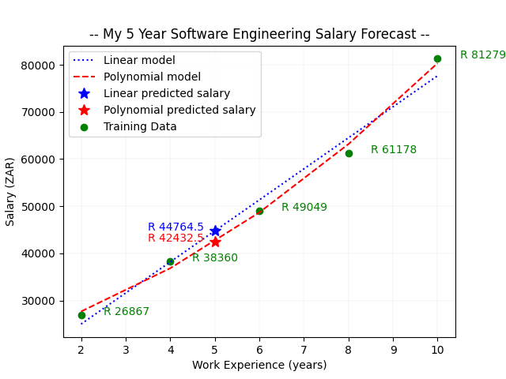

# Polynomial Regression | Work Experience vs Salary

A Python supervised ML algorithm to predict the salary of a Software Engineer.

## Description

This program is an supervised machine learning algorithm using Sklearn's polynomial regression function to model the relationship between Salary and the years of Work Experience.

The relationship between the independent variable ``years`` (x data) and the dependent variable ``salaries`` (y data) is modelled as an second degree polynomial to accurately predict my salary as a Software Engineer after 5 years of work experience.

The algorithm consists of the following steps:

* The ``years`` (x data) and ``salaries`` (y data) training arrays are initialised and reshaped.
* The training data is fitted to the ``LinearRegression()`` model to predict and plot the linear salary to years.
* The training data is then transformed with the ``PolynomialFeatures()`` model and fitted to the ``LinearRegression()`` model again to predict and plot the salary to years.
* An additional instance is created to predict and plot my 5 year salary.
* The years and salaries are scatter plotted with the predicted 5 year work experience salary.

## Programming principles

This program employs the programming concepts of algorithms together with numpy data structures, matplotlib and Sklearn's LinearRegression and PolynomialFeatures functions.

## Dependencies

* ``from sklearn.datasets import load_diabetes`` *(for the diabetes data set)*
* ``import numpy as np`` *(for arrays and maths functions)*
* ``import matplotlib.pyplot as plt`` *(for plotting)*
* ``from sklearn.linear_model import LinearRegression`` *(for fitting linear model)*
* ``from sklearn.preprocessing import PolynomialFeatures`` *(for fitting polynomial model)*

## Running the program

Run the ``poly.py`` file in any Python IDE.

## Code preview

```python
# ---------- Linear Regression model ---------- #

# Initialise LR object and fit the training data to it.
lin_model = LinearRegression()
lin_model.fit(years, salaries)

# Plot the linear regression results, in dotted blue line, of the years to the predicted salaries.
plt.plot(years, lin_model.predict(years), 'b:') 

# ---------- Polynomial Regression model ---------- #

# Initialise PR model and transform the training data with formula y = ß0 + ß1x + ß2x2 to the second degree to solve for the coefficient.
# Save instance of PR features for further fitting and predicting.
poly_model = PolynomialFeatures(degree = 2)
trans_years = poly_model.fit_transform(years)

# Initialise LR model and fit to the transformed polynomial terms.
poly_lin_model = LinearRegression().fit(trans_years, salaries)

# Plot the polynomial regression results, in dashed red line, of the years to the predicted salaries.
plt.plot(years, poly_lin_model.predict(poly_model.fit_transform(years)), 'r--') 

```

## Output preview

```text
My monthly salary forecast after 5 years of experience is R 42432.5
```

## Plotted graph



&nbsp;
***  
*If you torture the data long enough, it will confess.* ~ Ronald Coase
***
&nbsp;

## License

This project is licensed under the GNU GENERAL PUBLIC LICENSE.

## Author

**Megan Bisschoff** 2022

Project submitted for Software Engineering learnership Level 3 Task 21 at [HyperionDev](https://www.hyperiondev.com/)

[View](https://www.hyperiondev.com/portfolio/86596/) submission results.
